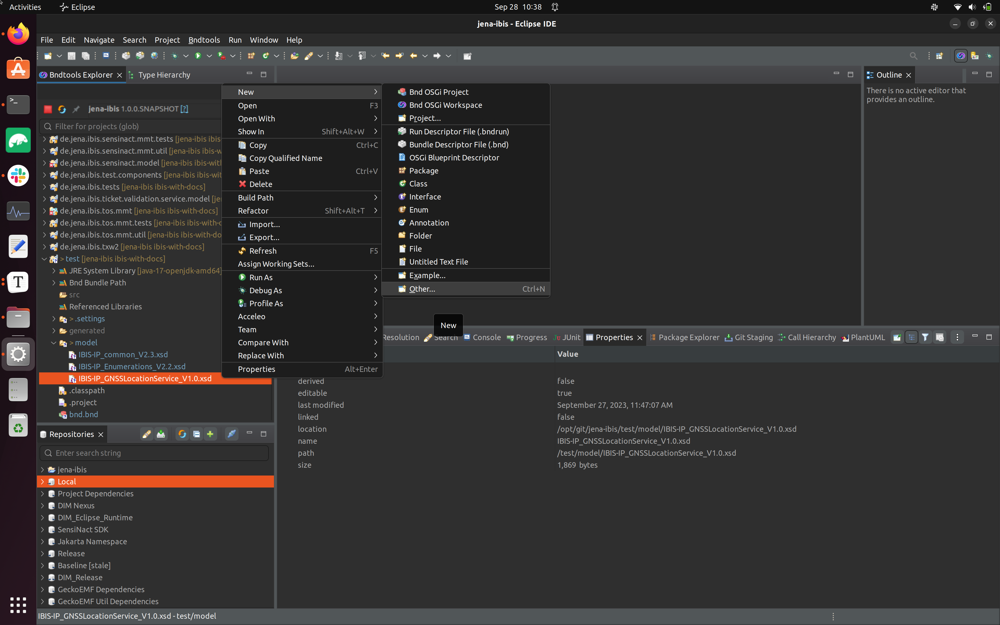
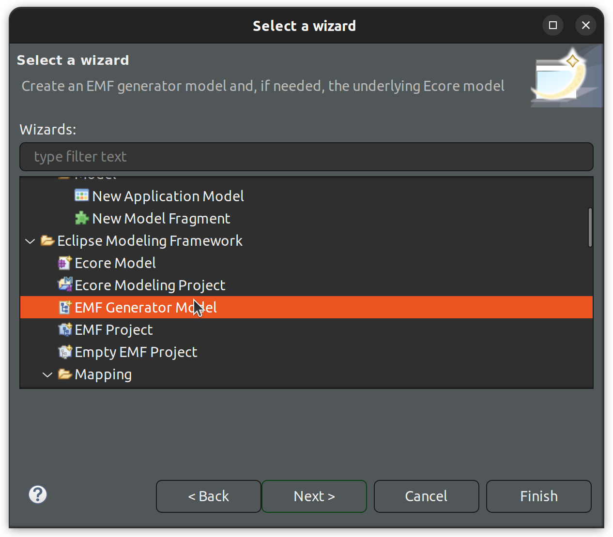
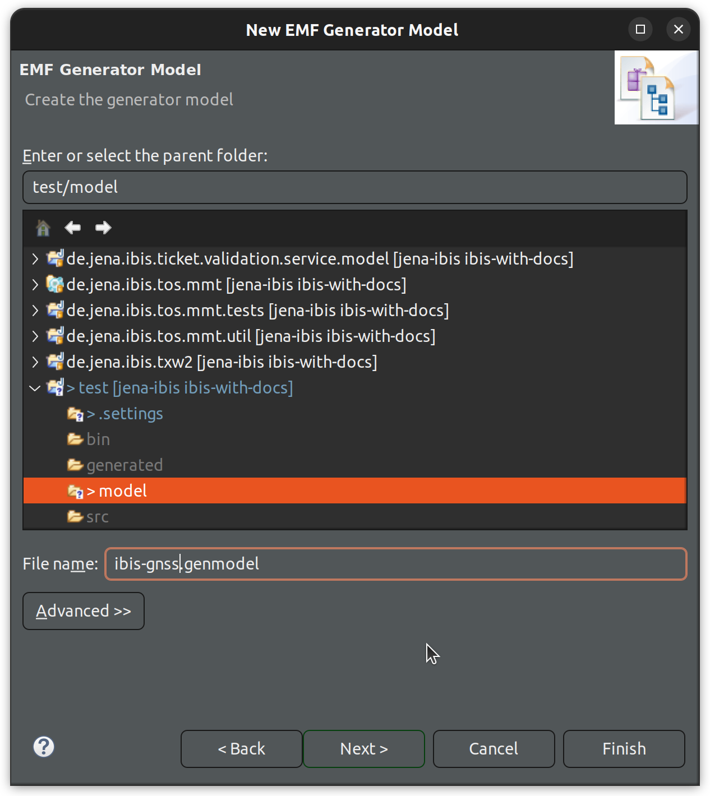
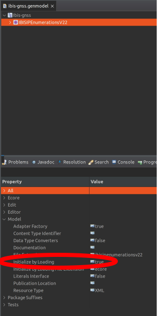

# IBIS IP Connection for Public Transport System

## Description

This project is intended to provide a way to connect to the IBIS-IP services running within the public transport vehicles in order to gather data from them, save them and publish them into the [sensinact]() broker.

## The Models

Dedicated EMF models have been created for the major IBIS-IP services. Those models are based on the official `xsd` models that can be found [here](https://github.com/VDVde/VDV301).

In particular, we created models for:

+ `CustomerInformationService`
+ `DeviceManagementService`
+ `GNSSLocationService`
+ `TicketValidationService`
+ `PassengerCountingService`
+ `DoorStateService`

The common structures, as well as the enumerations, are instead described in the corresponding `IBIS-IP_common` and `IBIS-IP_Enumerations` models, thus we created dedicated EMF models for them as well.

Every model is located in its own bundle, together with the original `xsd` files from which it has been generated. Slight modifications might have been applied then to the EMF model (e.g. refactor of some attribute names, etc.) to make them easier to handle.

## The IBIS Services

For each IBIS-IP service, we implemented a service component which, at activation subscribes to all the possible subscription operations provided by such service, in order to be ready to receive data from it. 

All the above mentioned IBIS-IP services send data via TCP, with the exception of the `GNSSLocationService`, which relies on the UDP protocol. Thus its implementation and configuration differs slightly from the others.

Anyway, once we get a new piece of information from one of the service operation, this is posted via MQTT to our DIM broker. 

## The Event Handlers

In the `de.jena.ibis.event.hanlders` bundle we currently have a separate lunch `bndrun` than can be started. An event handler there connects to our DIM broker, to listen to TCP and UDP messages sent from inside the public transport. The data is then saved into a db and posted to the sensinact broker. A second handler connects to the sensinact broker and repost the event to our DIM MQTT broker. 

For the saving operation, we are using the model available [here](https://github.com/de-jena/upd-models/tree/snapshot/de.jena.udp.trafficos.publictransport.model). 

## Trouble Shooting

### GenModel template from XSD

When generating the EMF models from the `xsd` files, we proceeded in this way, within the Eclipse IDE:

+ We generated a `genModel` and the corresponding `ecore` from the xsd file;
+ We modified as needed the generated `ecore` file
+ We reload the `genModel` from the modified `ecore`
+ We generate the code via our gecko EMF code generator

Let's look at the first step of this process in details.

Given an `xsd` file, we can right click on it, and select `New->Other...` from the Eclipse IDE.

In the newly opened window, select then `EMF Generator Model`.

We are asked then to give a name to the `genmodel`, so let's choose a shorter name that the one of the `xsd` file, for instance, and we do the same for the corresponding `ecore` in the next dialog page. Let's click `Finish` and we are done.

If we now take a look at the generated `genModel`, selecting the package and looking at the `Properties` view, we can see that, by default the option `Initialize by Loading` is set to `true`.

This causes, every time we generate the code out of our model, to reload the package. What is more of an issue, is that the package is expected to load should have an `ecore` file with exactly the same name as the package itself. 

This means, if you want to name them differently, you are going to encounter a problem. At runtime, when you want to actually use your model bundle, you would see some `TargetInvocationException` due to the "missing serialized package".

So, it's important, when you generate an EMF model from an `xsd` that you remember to set this option manually to `false`.